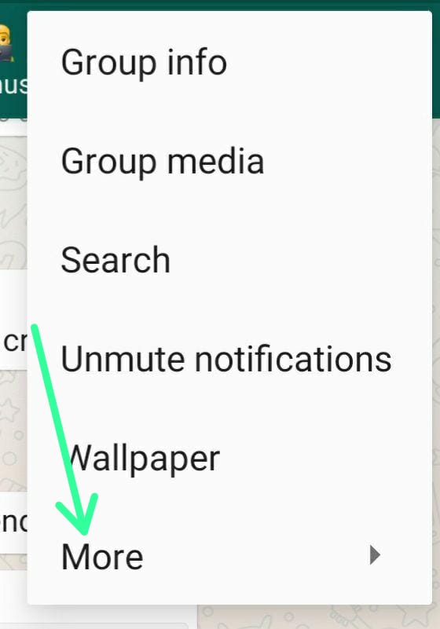
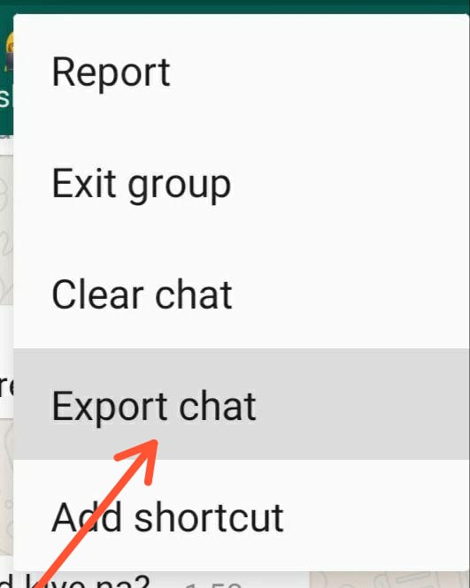

# SP Chat Detective: Uncovering the Secrets of Your WhatsApp Conversations
Developed and designed a user-friendly WhatsApp chat analysis web app using Streamlit that provides
both group and individual person analysis.

# *Introduction*:
Whatsapp has quickly become the world’s most popular text and voice messaging application. Specializing in cross-platform messaging with over 2 billion  active users, this makes it the most popular mobile messenger app worldwide.
- I thought of various projects on which I could analyse data like - *Air Quality Index kolkata using ML*
- But I thought why not do **Data Analysis on a WhatsApp group chat** of *college students* and find out interesting insights about  features such as media share count, total messages, total words, total link shares, monthly and
daily timelines, busiest day and month, weekly activity map, most active user, word cloud, and the most overused word.

# *Data Retrieval & Preprocessing*
### Beginning. How do I export my conversations? From Where To Obtain Data?
- The first step is **Data Retrieval & Preprocessing**, that is to **gather the data**. WhatsApp allows you to **export your chats** through a **.txt format**.
- Go to the respective chat, which you want to export!

- Tap on **3 dot options**, click on **More**, and **Export Chat.**

- I will be Exporting **Without Media.**

#### NOTE:

- While exporting data, *avoid including media files* because if the number of media files is greater than certain figure then not all the media files are exported.

# *Demo*
- What my Detective can show you 😲

## The App interface

The app interface look two mood.
- dark mood👇

- light mood👇

## The Most stat-tastic 
Here I show the overall stats like **Total Message**, **Total Words**, **Media shared**, **Link Shared**.

